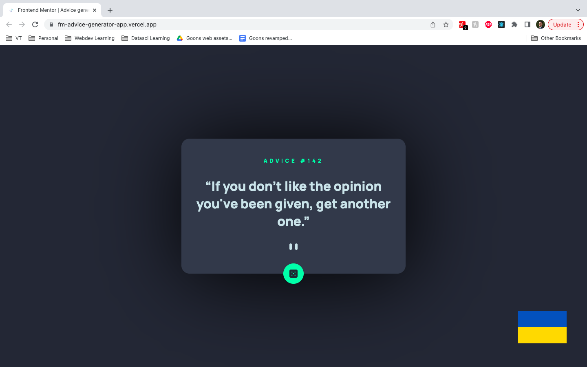

# Frontend Mentor - Advice generator app solution

This is a solution to the [Advice generator app challenge on Frontend Mentor](https://www.frontendmentor.io/challenges/advice-generator-app-QdUG-13db). Frontend Mentor challenges help you improve your coding skills by building realistic projects.

## Table of contents

- [Overview](#overview)
  - [Screenshot](#screenshot)
  - [Links](#links)
- [My process](#my-process)
  - [Useful resources](#useful-resources)
- [Author](#author)

## Overview
### Screenshot

### Links

- Solution URL: [GitHub](https://github.com/wongd-hub/fm-advice-generator-app/)
- Live Site URL: [Vercel](https://fm-advice-generator-app.vercel.app/)

## My process

### Built with

- [React](https://reactjs.org/) - JS library
- [Next.js](https://nextjs.org/) - React framework

### Useful resources

- [Creating Glow Effects with CSS](https://codersblock.com/blog/creating-glow-effects-with-css/)

## Author

- Website - [GitHub](https://github.com/wongd-hub)
- Frontend Mentor - [@wongd-hub](https://www.frontendmentor.io/profile/wongd-hub)
